# System Architecture Explanation - PayGuard Fraud Detection

## Docker Containers Overview

The PayGuard fraud detection system uses **5 Docker containers** working together on a shared Docker network.

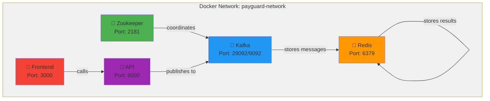

---

## Container 1: Zookeeper

### Overview
**Coordination Service for Kafka** - Manages Kafka broker state and configuration

### Configuration
```yaml
Image: confluentinc/cp-zookeeper:7.5.0
Port: 2181
Network: payguard-network
Environment:
  ZOOKEEPER_CLIENT_PORT: 2181
  ZOOKEEPER_TICK_TIME: 2000
```

### Purpose in This Project
- **Manages Kafka State**: Tracks broker health, configuration, and metadata
- **Leader Election**: Ensures cluster stability
- **Configuration Storage**: Maintains topic and permission info
- **Broker Discovery**: Keeps track of which brokers are available

### Responsibilities

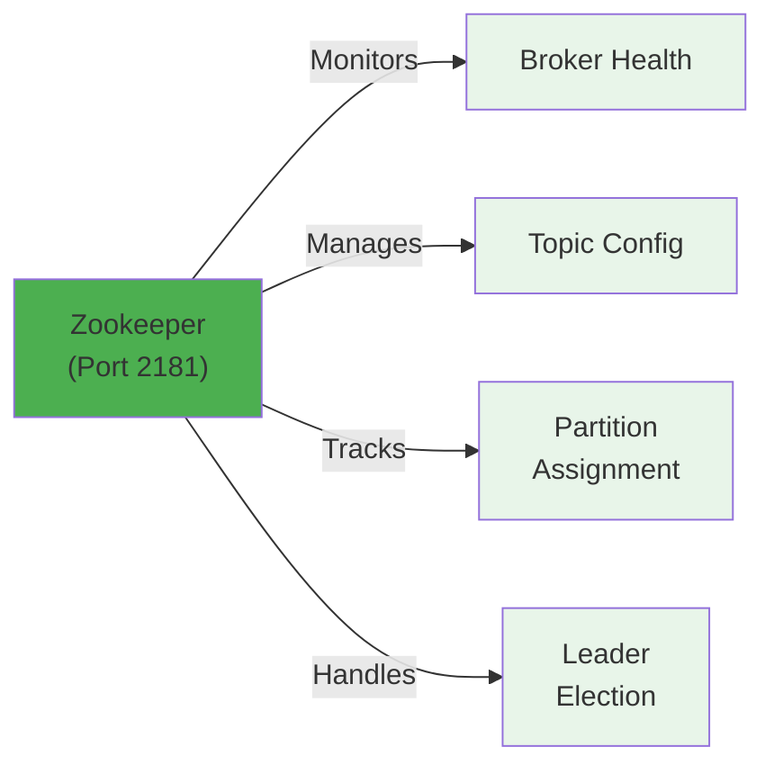

### Why It's Needed
- Kafka **requires** Zookeeper to function
- Without Zookeeper, Kafka can't coordinate
- Single instance fine for development
- Production would use Zookeeper cluster for HA

### Startup
- Starts first (no dependencies)
- Other containers wait for it to be ready

---

## Container 2: Kafka

### Overview
**Asynchronous Message Broker** - Queues transactions for processing

### Configuration
```yaml
Image: confluentinc/cp-kafka:7.5.0
Ports:
  - 9092:9092        (external: localhost:9092)
  - 29092 (internal) (inside Docker: kafka:29092)
Network: payguard-network
Broker ID: 1
Topic: transactions (auto-created)
```

### Message Flow Through Kafka

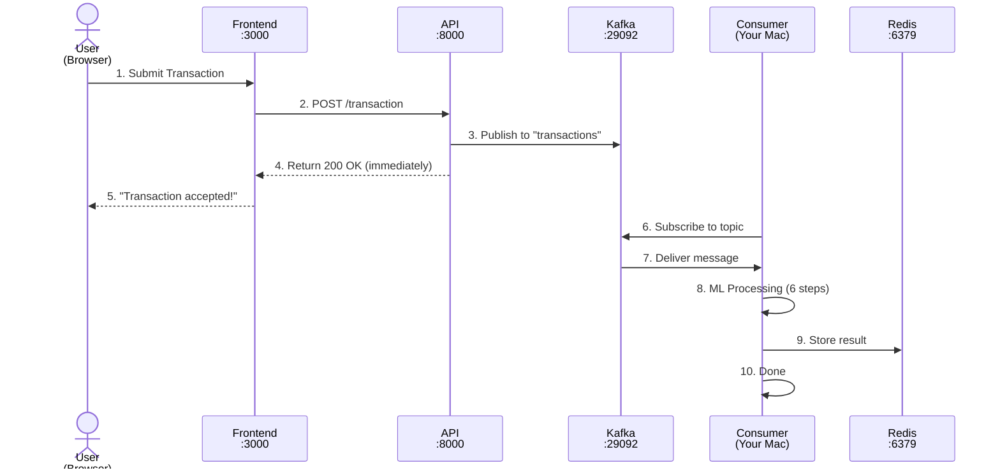

### Data Structure in Kafka

```json
Topic: "transactions"
Message: {
  "user_id": "user_123",
  "amount": 75.50,
  "merchant": "Starbucks Coffee",
  "description": "Morning coffee",
  "currency": "USD",
  "timestamp": "2026-04-24T21:30:00Z"
}
```

### Purpose in This Project
- **Decouples API from Consumer**: API doesn't wait for fraud detection
- **Handles High Throughput**: Can queue thousands of transactions
- **Persistence**: Transactions survive crashes
- **Scalability**: Multiple consumers can process same topic

### Listener Configuration

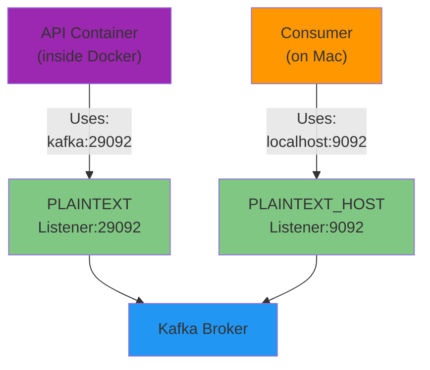

### Common Issues
- **API error 503**: Kafka not ready when API starts
- **Consumer can't connect**: Using wrong address (kafka:29092 from Mac won't work)
- **Messages not persisting**: Volume issue or broker crash

---

## Container 3: Redis

### Overview
**In-Memory Cache & Result Storage** - Stores transaction fraud detection results

### Configuration
```yaml
Image: redis:7.2-alpine
Port: 6379
Network: payguard-network
Volume: redis_data
Health Check: redis-cli ping
```

### Data Flow to Redis

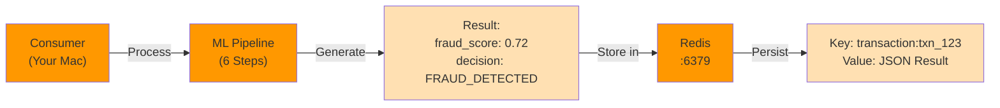

### Result Data Structure

```json
Key: transaction:txn_abc123

Value: {
  "transaction_id": "txn_abc123",
  "user_id": "user_xyz",
  "amount": 75.50,
  "merchant": "Starbucks Coffee",
  "fraud_score": 0.12,
  "decision": "APPROVED",
  "risk_level": "LOW",
  "timestamp": "2026-04-24T21:30:00Z",
  "features": {
    "amount_std_dev": 0.8,
    "velocity": 0.1,
    "geographic_score": 0.0,
    "time_of_day": 0.05
  }
}
```

### Use Cases in System

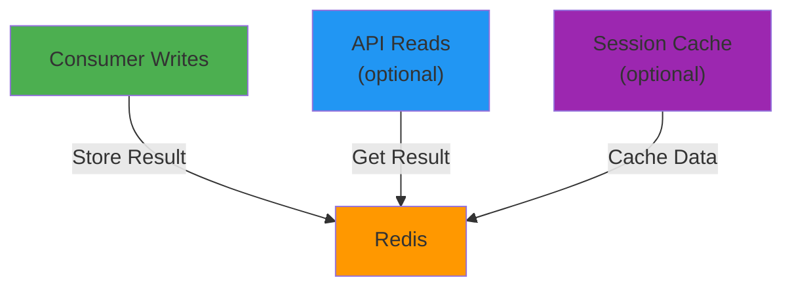

### Why It's Needed
- **Performance**: Instant result lookups (microseconds vs milliseconds)
- **Scalability**: Multiple API instances can share results
- **TTL Support**: Auto-expire old transactions
- **No Database**: Simpler architecture for POC
- **Pub/Sub**: Can notify about suspicious transactions

### Persistence
- Data persists to `/data` volume
- Survives container restart
- RDB snapshots and AOF (append-only file)

---

## Container 4: API (FastAPI)

### Overview
**Transaction Intake & Validation Engine** - REST API for transaction submission

### Configuration
```yaml
Build:
  context: .
  dockerfile: api/Dockerfile
Base Image: python:3.11-slim
Port: 8000
Network: payguard-network
Framework: FastAPI
Language: Python
```

### Complete Transaction Flow Through API

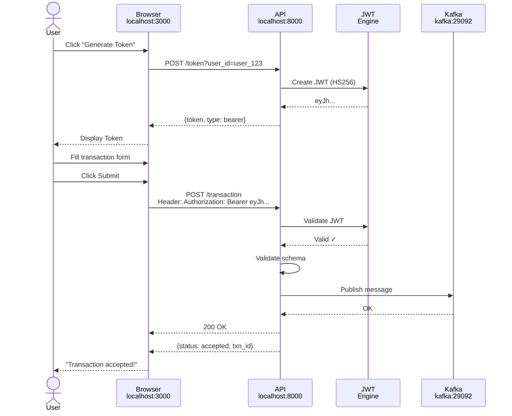

### API Endpoints

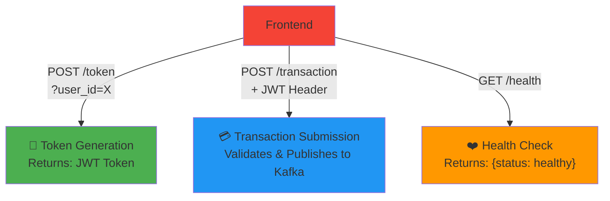

### Key Features
- ✅ **JWT Authentication**: HS256 algorithm
- ✅ **CORS Enabled**: Allows http://localhost:3000
- ✅ **Input Validation**: Pydantic models
- ✅ **Async Publishing**: Doesn't wait for consumer
- ✅ **Error Handling**: 503 if Kafka unavailable
- ✅ **Logging**: Structured JSON logs

### Startup Dependencies

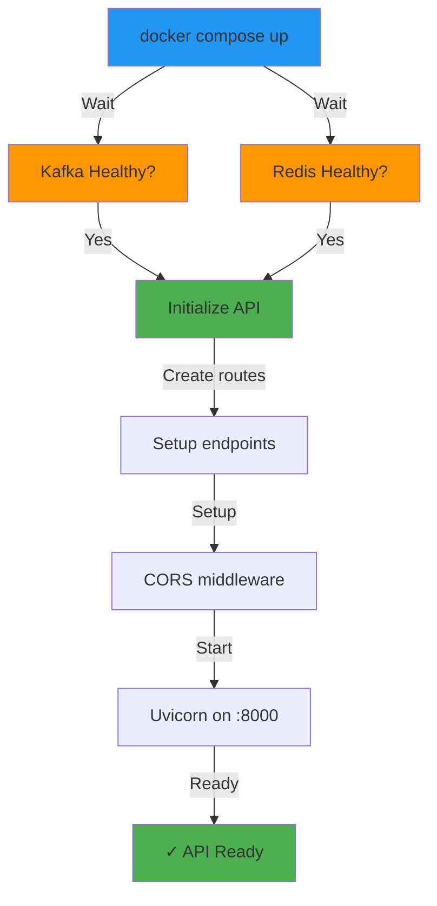

---

## Container 5: Frontend (React)

### Overview
**User Interface** - React web application for transaction submission

### Configuration
```yaml
Build:
  context: ./frontend
  dockerfile: Dockerfile
Base: node:18-alpine
Port: 3000
Network: payguard-network
Framework: React 18 + TypeScript
Build Tool: Vite
Server: serve
```

### User Interaction Flow

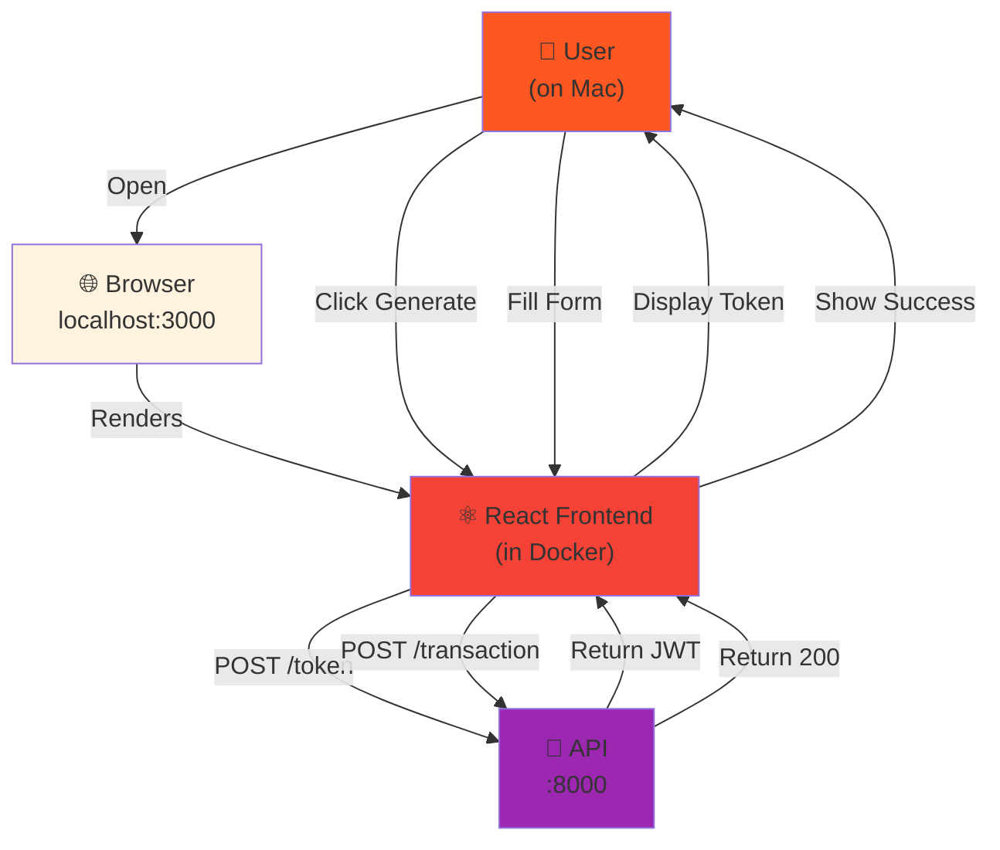

### Build Process

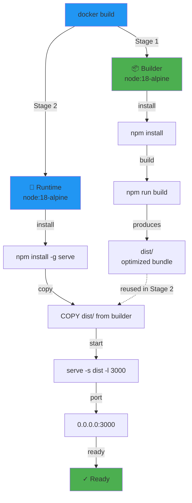

### Frontend to API Communication

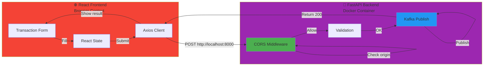

---

## Complete Data Flow: End-to-End

### Full Journey of a Transaction

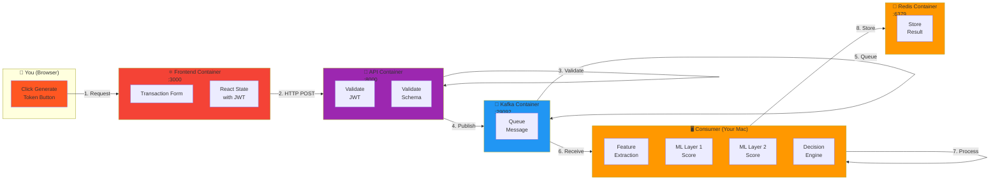

### Happy Path: Normal Transaction

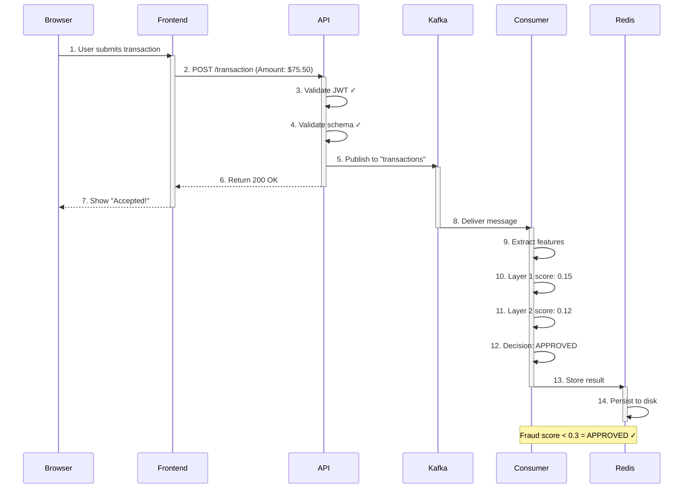

### Fraud Path: High-Value Transaction

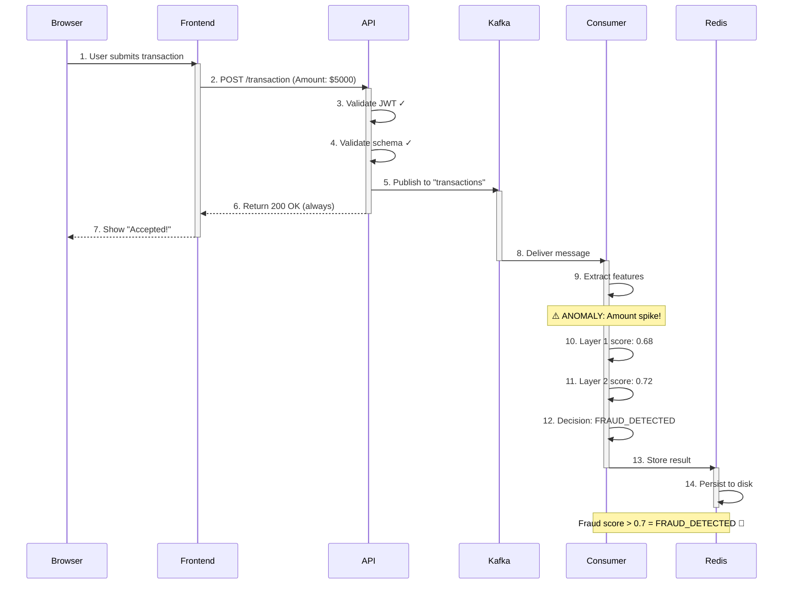

---

## Container Networking

### Docker Network Architecture

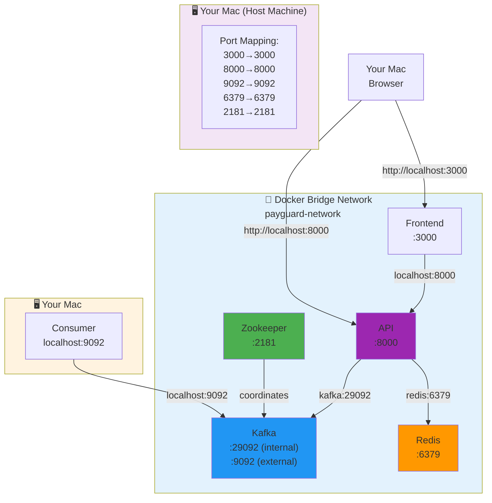

### Service Name Resolution

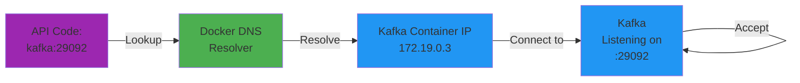

---

## Startup Sequence

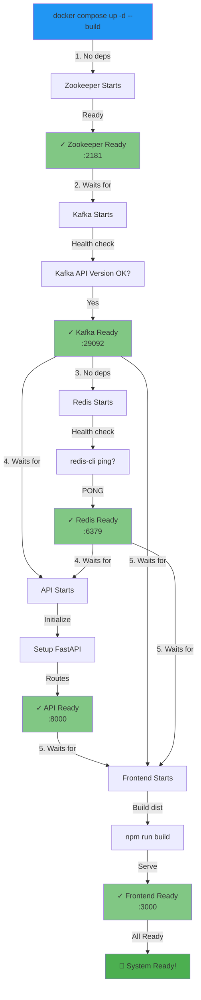

---

## Communication Paths

### Valid Connections

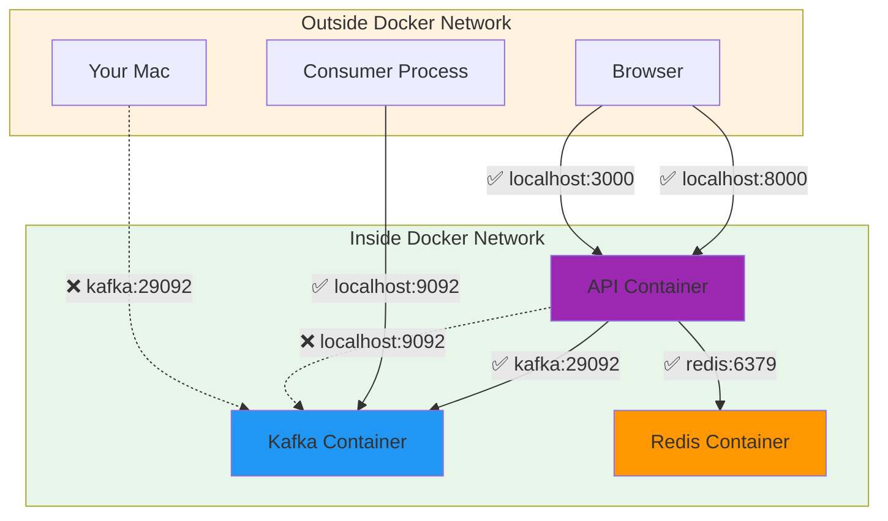

---

## Resource Usage & Performance

### Container Resource Estimates

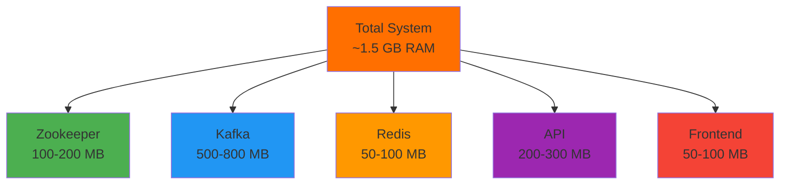

### Typical Latency

```mermaid
graph LR
    USER["User<br/>Action"]
    API_CALL["API Call<br/>&lt;10ms"]
    KAFKA["Kafka<br/>Publish<br/>&lt;50ms"]
    CONSUMER["Consumer<br/>Receive<br/>&lt;100ms"]
    ML["ML<br/>Processing<br/>200-500ms"]
    REDIS["Redis<br/>Store<br/>&lt;10ms"]
    
    USER -->|⏱️| API_CALL
    API_CALL -->|⏱️| KAFKA
    KAFKA -->|⏱️| CONSUMER
    CONSUMER -->|⏱️| ML
    ML -->|⏱️| REDIS
    
    style USER fill:#FF5722
    style API_CALL fill:#4CAF50
    style KAFKA fill:#2196F3
    style CONSUMER fill:#FF9800
    style ML fill:#FF9800
    style REDIS fill:#FF9800
```

---

## Summary Table

| Container | Image | Port | Purpose | Depends On | Status |
|-----------|-------|------|---------|-----------|--------|
| **Zookeeper** | confluentinc/cp-zookeeper | 2181 | Kafka coordination | None | Always up |
| **Kafka** | confluentinc/cp-kafka | 29092/9092 | Message broker | Zookeeper ✓ | Healthy |
| **Redis** | redis:alpine | 6379 | Result caching | None | Healthy |
| **API** | python:3.11-slim | 8000 | Transaction intake | Kafka, Redis ✓ | Running |
| **Frontend** | node:18-alpine | 3000 | User interface | API ✓ | Healthy |

---

## Key Concepts

### Asynchronous Processing
The API returns immediately (200 OK) without waiting for fraud detection results. Consumer processes transactions asynchronously from Kafka queue.

### Service Discovery
Docker's embedded DNS server resolves service names (kafka, redis, etc.) to container IPs on the payguard-network.

### Port Mapping
Exposes container ports to host machine:
- Internal communication: Container name + internal port (kafka:29092)
- External access: localhost + exposed port (localhost:9092)

### Health Checks
Each container declares how to verify it's healthy. Other containers wait for dependencies to be healthy before starting.

### Data Persistence
Redis volume ensures results survive container restarts. Kafka and Zookeeper also persist their data.

---

This architecture enables:
✅ **Scalability** - Add more consumers for parallel processing
✅ **Reliability** - Kafka persists messages
✅ **Performance** - Async processing doesn't block frontend
✅ **Testability** - Each component can be tested independently
✅ **Maintainability** - Clear separation of concerns
